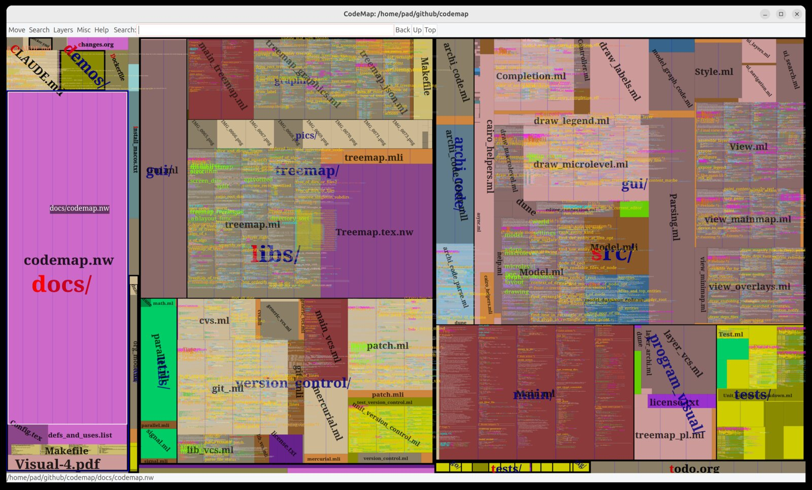

# Codemap

A Google Maps for source code. Codemap renders zoomable treemap-based
bird's-eye views of codebases with code thumbnails and semantic syntax
highlighting — zooming in progressively reveals more detail, just like
a map. Uses [semgrep](https://github.com/semgrep/semgrep) parsers for
multi-language highlighting via a GTK2/Cairo GUI.



## Building

### Prerequisites

OCaml 4.14+ (via opam >= 2.1), gcc, git, curl, pkg-config.

On Ubuntu/Debian:
```bash
apt-get install build-essential pkg-config opam curl libcairo2-dev libgtk2.0-dev
```

On macOS:
```bash
brew install opam pkg-config cairo gtk+
```

C libraries (pcre, pcre2, gmp, libev, libcurl) are installed automatically
by `./configure` via opam — no need to install them manually.

### Quick start

```bash
git clone --recurse-submodules https://github.com/aryx/codemap
cd codemap
./configure     # installs opam deps and sets up tree-sitter (run infrequently)
make            # routine build
make test       # run tests
```

### Docker

A reference build using Ubuntu is provided:

```bash
docker build -t codemap .
```

To build with OCaml 5:
```bash
docker build -t codemap --build-arg OCAML_VERSION=5.2.1 .
```

## Usage

```bash
codemap ~/my-project
```

This launches a GTK-based GUI that lets you visualize source code
and perform code search.

See the [old codemap page at Facebook](https://github.com/facebookarchive/pfff/wiki/CodeMap)
for more information.

## Inspiration

Codemap combines ideas from several software visualization projects:

- **[SeeSoft](https://www.semanticscholar.org/paper/Seesoft-A-Tool-For-Visualizing-Line-Oriented-Eick-Steffen/0e48f7fb11eca258d2bb3c343e9ac9cc5fab57ce)** — Eick, Steffen, and Sumner at Bell Labs (1992). One of the earliest tools for visualizing line-oriented software statistics, mapping each line of code to a thin colored row. See also Ball and Eick's follow-up, [Software Visualization in the Large](https://www.semanticscholar.org/paper/Software-Visualization-in-the-Large-Ball-Eick/668bb2b975f762d5eb596873671af3e18965daa2) (1996), which extended these ideas with multiple visual representations (line, pixel, file summary, hierarchical).
- **[Code Thumbnails](https://www.microsoft.com/en-us/research/publication/code-thumbnails-using-spatial-memory-to-navigate-source-code/)** — DeLine et al. at Microsoft Research (2006). Miniature code renderings as navigation aids, showing that the visual structure of code provides useful spatial cues even at tiny scales.
- **[Treemap visualization of the Linux kernel](https://www.cs.umd.edu/hcil/millionvis/Treemap_Visualization_of_the_Linux_Kernel_2_5_33.html)** — Fekete and Plaisant at UMD HCIL (2002). The idea of using treemaps for source code layout, which codemap combines with code thumbnails and SeeSoft-style coloring.
- **Google Maps** — The zoomable interface that progressively reveals more detail as you zoom in. In codemap, important code is bigger (like major roads on a map), and zooming in gradually shows file content, then syntax-highlighted code.
